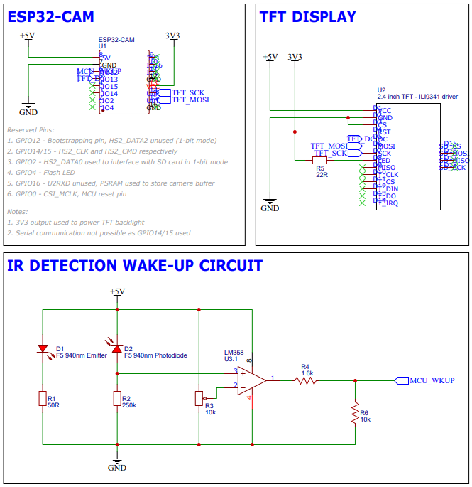
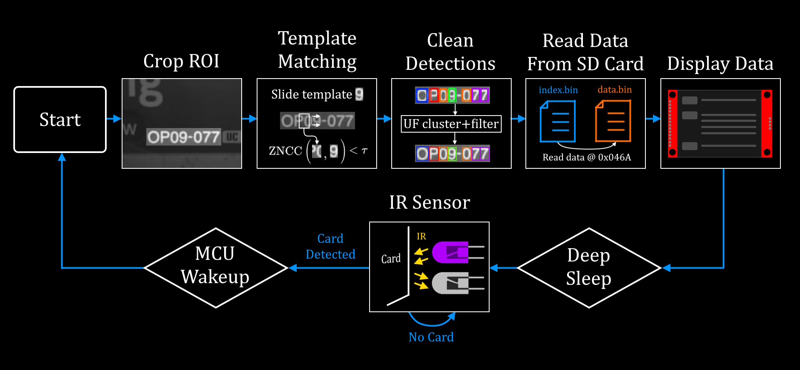

# Product
A handheld card scanner for a trading card game (TCG) that retrieves the English translation and market price of a card through an API using its detected card number.

# Problem Statement
There's no such device that currently exists on the market except for phone apps which may be banned in official tournaments. Googling translations is also inconvenient and disrupts the game. Japanese cards are cheaper in general but this makes it hard for non-Japanese speaking players to get into the hobby. Some countries also restrict usage of cards to their native language only.

# Hardware
| #   | Component                             |
| --- | ------------------------------------- |
| 1   | ESP32-CAM                             |
| 2   | 2.4-inch TFT display (ILI9341 driver) |
| 3   | 940nm infrared emitter                |
| 4   | 940nm infrared photodiode             |
| 5   | LM358 operational amplifier           |

# Pinout

# Concept

The ESP32-CAM takes 160x120px images, then Normalized Cross-Correlation (NCC) is performed between the image and templates stored in flash memory to perform letter recognition. Edge computing using Edge Impulse to load a TinyML model onto the ESP32-CAM would've been resource-intensive and as such, was not implemented, although a future ablation study will be considered. Duplicate letter detections are grouped based on Euclidean distance through a union-find tree structure, then the detected letter with the highest NCC score is kept while the rest are discarded, somewhat like NMS. Querying a card database API through WiFi draws too much current and brown-out resets the board. To address this, I store card data onto an SD card loaded into the board which is automatically updated on a weekly basis, then use a binary search algorithm to lookup the byte address of a card in "index.bin" and seeking that address on "data.bin" at that specific address. Retrieved card data is displayed on a TFT display.

# TODO
- [x] Images successfully taken and stored as byte arrays.
- [x] Camera flash sufficiently lights up ROI.
- [x] NCC algorithm and detection pruning works.
- [x] Detected card ID and associated card data can be retrieved from SD card memory.
- [x] Card data is displayed on TFT display.
- [ ] Card data in SD card is updated weekly using HTTP requests.
- [ ] Compile TinyML model from Edge Impulse onto ESP32-CAM and create ablation study with current method.
- [ ] Circuit fits into 3D printed enclosure.

# Bugs
- [ ] Most characters are correctly recognized but some letter patterns appear within other letters, e.g. "1" inside "T", "6" inside "8".
    - Temporary solution - Add hard-coded padding around templates (padding pixels take min. value of template) which penalizes NCC score when letter patterns are detected within other letters.